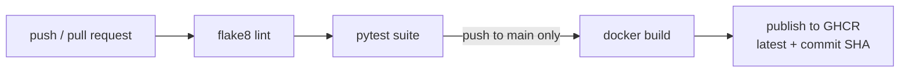

# flask-docker-cicd

A small Flask service with a production-style Dockerfile and a complete GitHub Actions CI/CD pipeline: every push is linted and tested; pushes to `main` additionally build the container image and publish it to GitHub Container Registry.

Rebuild of the containerization and CI/CD projects I originally put together while doing DevOps-oriented web work — recreated as a public demo in August 2026, since the originals weren't mine to publish.

## Pipeline



Design choices worth noting: publishing **requires** tests to pass (`needs: lint-and-test`), PRs get lint+test but never publish, images are tagged with both `latest` and the exact commit SHA (so any running container can be traced to its source), and the workflow uses the repo-scoped `GITHUB_TOKEN` — no long-lived registry credentials to leak.

## The app

Three endpoints (`/`, `/health`, `/api/info`) built with an app-factory pattern so tests and gunicorn import the same code path. `/health` doubles as the Docker `HEALTHCHECK` probe.

## The container

- `python:3.12-slim` base — small surface, fast pulls
- dependency layer copied and installed **before** app code, so edits to `app.py` don't bust the pip cache
- runs as a **non-root** user
- `HEALTHCHECK` hits the app's own `/health` endpoint
- serves via gunicorn, not the Flask dev server

## Run it

```sh
# locally
pip install -r requirements-dev.txt
flake8 . && pytest -v          # what CI runs
python3 app.py                 # dev server on :8000

# containerized
docker compose up --build      # http://localhost:8000/health
```

## Repository structure

```
├── app.py                     # Flask app (app factory)
├── test_app.py                # pytest suite
├── Dockerfile                 # slim, cached layers, non-root, healthcheck
├── docker-compose.yml
├── requirements.txt           # runtime deps
├── requirements-dev.txt       # + pytest, flake8
└── .github/workflows/ci.yml   # lint → test → build → publish (GHCR)
```

## Next steps

- Coverage gate (pytest-cov + minimum threshold) before publish
- Trivy image scan step between build and push
- A `staging` branch that publishes with a `:staging` tag for pre-prod smoke tests
